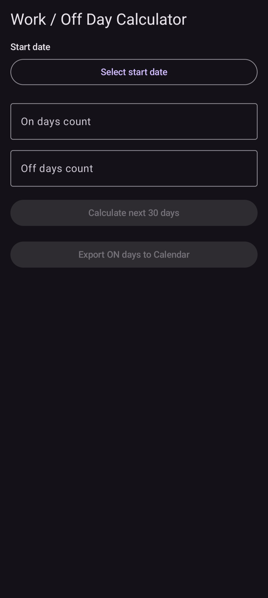
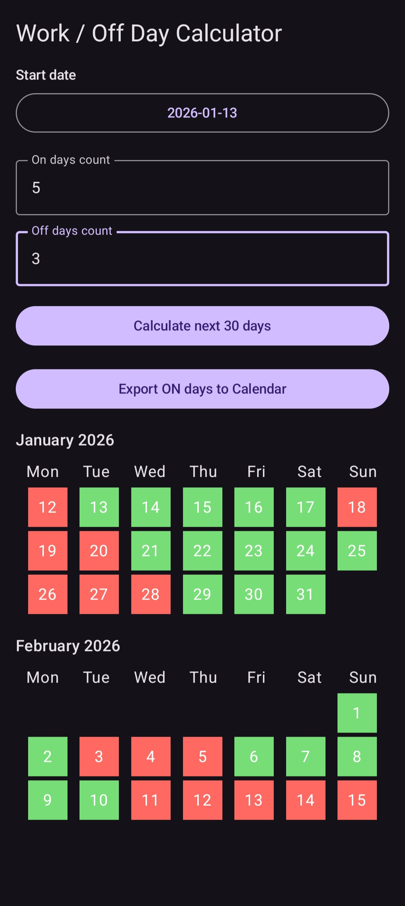

# WorkDayCalculator

A simple Android app to calculate your work/off day schedule and export your ON days to your Google Calendar.

The app allows you to:

- Select a **start date**.
- Enter the number of **ON days** and **OFF days** in your work cycle.
- Calculate your work schedule for the next 30 days.
- Visualize your schedule in a **calendar view**.
- Export your ON days directly to your **Google Calendar**.
- Receive a **notification/snackbar** confirming the exported days.

## Screenshots

Starting view:




Calculated shifts:




## Features

- **Customizable work cycle**: Set any number of ON and OFF days.
- **Interactive calendar view**: ON days are highlighted in pastel green, OFF days in pastel red.
- **Calendar export**: Export all ON days to Google Calendar with one click.
- **Snackbar confirmation**: Shows how many days were exported.
- **Edge-to-edge UI**: Modern Material3 design with dark mode support.

## How to Use

1. Install the app on your Android device.
2. Open the app and select a **start date**.
3. Enter your **ON days** and **OFF days** count.
4. Click **"Calculate next 30 days"** to see your schedule.
5. Click **"Export ON days to Calendar"** to add the work days to your calendar.

## Requirements

- Android Studio 2022.2 or higher
- Minimum Android API 26 (Android 8.0)
- Permissions:
    - `WRITE_CALENDAR`
    - `READ_CALENDAR`

## Installation

1. Clone this repository:

```bash
git clone https://github.com/MartaSirsnina/WorkShiftCalendar.git
